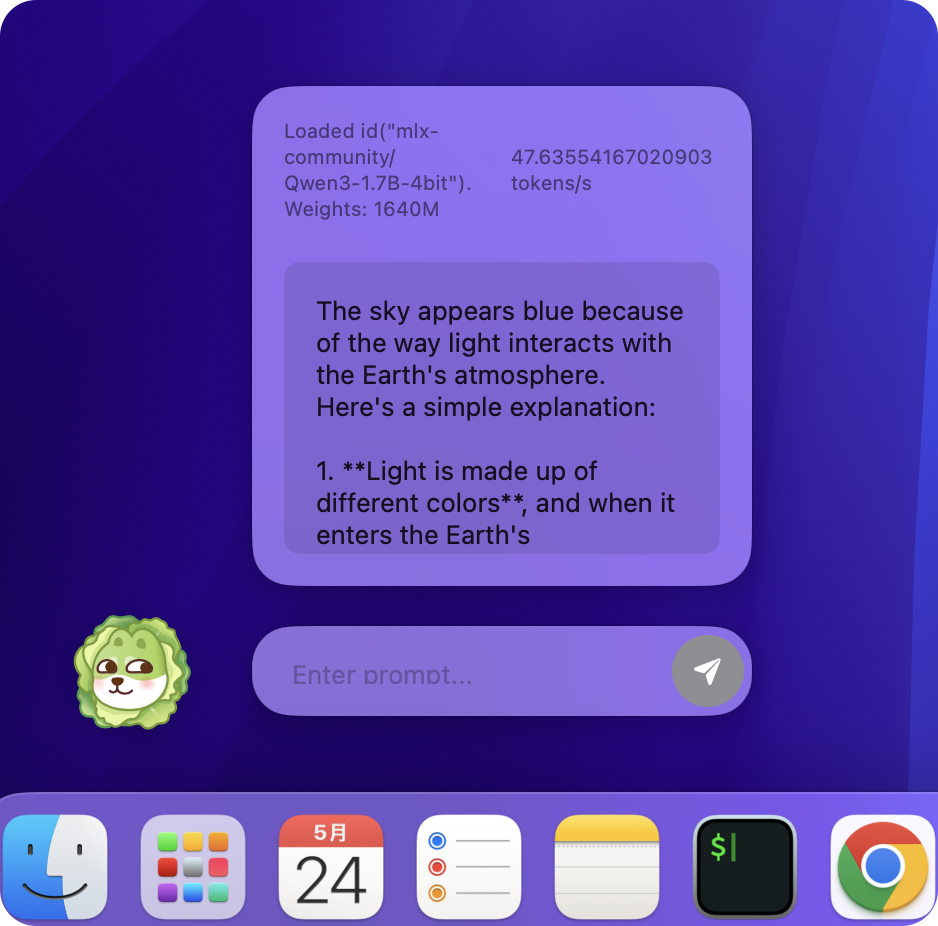
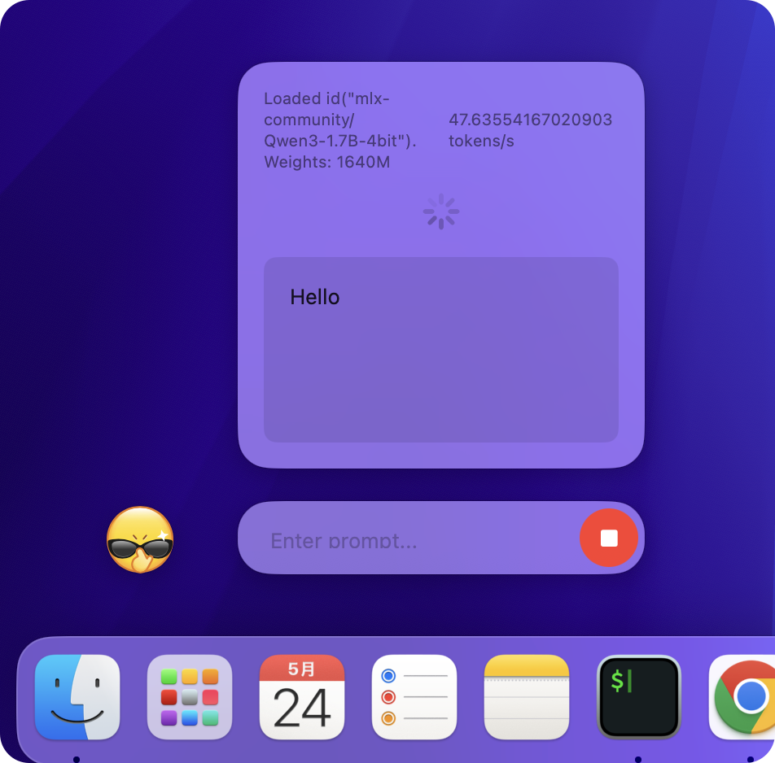

# CuteMLX 😊

> Inspired by MacPaw's Eney https://macpaw.com/eney

  
  

## Requirements
- MLX-Swift https://github.com/ml-explore/mlx-swift-examples
- Lottie for iOS https://github.com/airbnb/lottie-ios

## Lottie Resources

> ⚠️⚠️⚠️ Please note that this project does not provide any Lottie resources; all resources must be obtained independently.

`CuteMLX/lottiefiles` -> `Thinking.json` & `VegetableDog.json` Lottie Resources sourced from here
- https://www.v2ex.com/t/791772
- https://lottiefiles.com/search?q=emoji&category=animations

## License
MIT License